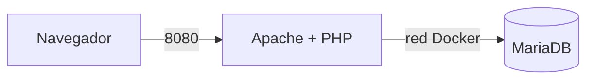

# INTRODUCCION

---

# INDICE

---

# STACK Y TECNOLOGIAS

---

# Arquitectura

La arquitectura del proyecto está formada por dos servicios principales:

- `web`: contiene Apache y PHP.
- `db`: contiene MariaDB.

El navegador se conecta al puerto `8080` del equipo y Docker redirige la petición al puerto `80` del contenedor web.

El servidor web se comunica con MariaDB mediante la red interna de Docker.

---

# MONEDAS

## Moneda 1: 

En la tabla ranking hay una fila cuyo jugador es una moneda (no sale en la web).
Encuéntrala con el cliente SQL y cópiala en el README.

 9 | MONEDA-1: ARC-7X3K | secreto        |      0 

 **MONEDA 1: ARC-7X3K**

## Moneda 2: Aparece en la página cuando la conexión funciona. Cópiala en el README.

**MONEDA 2: ARC-Q9M2**

## Moneda 3: te la doy yo en directo cuando compruebe curl -I y docker compose ps en tu equipo.

**MONEDA 3: SE DARA EN CLASE**

--- 

# PREGUNTAS

**¿por qué no le pasamos al servicio web la contraseña de root de la base de datos (env_file: .env)?**
Porque se vasta con el usuario arcade

**Copia en el README el resultado de SHOW GRANTS**

+--------------------------------------------------------------------------------------------------------+
| Grants for jugador@%                                                                                   |
+--------------------------------------------------------------------------------------------------------+
| GRANT USAGE ON *.* TO `jugador`@`%` IDENTIFIED BY PASSWORD '*25191BA4E6DA0D23829FB51E56726069C4BED650' |
| GRANT ALL PRIVILEGES ON `arcade`.* TO `jugador`@`%`                                                    |
+--------------------------------------------------------------------------------------------------------+

**¿sobre qué base de datos tiene permisos el usuario jugador? ¿Por qué no usamos root desde la aplicación?**

//////////RESPONDER&&&&&&&&&&&&&&&&&&&

---

# PROBLEMAS QUE ENCONTRE Y SOLUCIONE

