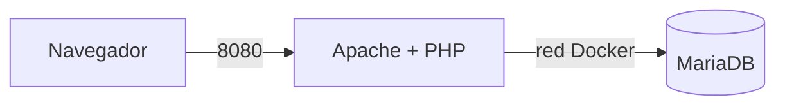

# INTRODUCCION

**AUTOR:**Ivan Garrigues Segui

**PROYECTO:**Practica final RA1 — Salon recreativo

**OBJETIVO:**El objetivo de la práctica es desplegar una aplicación web de un salón recreativo utilizando contenedores con Apache + PHP + MariaDB

---

# STACK Y TECNOLOGIAS

| Tecnología | Función |
|---|---|
| Docker | Contenedorización de los servicios |
| Docker Compose | Orquestación de los contenedores |
| Apache | Servidor web |
| PHP 8.3 | Lenguaje utilizado por la aplicación del servidor |
| mysqli | Extensión de PHP para conectar con MariaDB |
| MariaDB | Sistema gestor de bases de datos |
| HTML | Estructura de la página web |
| Git / GitHub | Control de versiones del proyecto |

### tecnologias entre el cliente y servidor

**Servidor hace uso de:**

- Apache.
- PHP.
- mysqli.
- MariaDB.

**Cliente utilixa:**

- Navegador web.
- HTML mostrado por la aplicación.

---

# ARQUITECTURA

La arquitectura del proyecto está formada por dos servicios principales:

- `web`: contiene Apache y PHP.
- `db`: contiene MariaDB.

El navegador se conecta al puerto `8080` del equipo y Docker redirige la petición al puerto `80` del contenedor web.

El servidor web se comunica con MariaDB mediante la red interna de Docker.



### Flujo de funcionamiento

1. El usuario accede desde el navegador a `http://localhost:8080`.
2. La petición llega al contenedor de Apache.
3. Apache ejecuta el código PHP.
4. PHP se conecta a MariaDB utilizando el usuario `jugador`.
5. MariaDB devuelve los datos del ranking.
6. PHP genera la página HTML.
7. El navegador recibe y muestra la página.

# ESTRUCTURA DEL PROYECTO

La estructura principal del proyecto es:

```text
salon-recreativo/
├── docker-compose.yml
├── .env
├── .env.example
├── .gitignore
├── Dockerfile
├── db/
│   └── init.sql
├── src/
│   └── index.php
└── README.md
```


---

# DESPLIEGUE

Para poder desplegar este proyecto se debe tener docker y docker compose instalados

## 1. Clonar el proyecto

Se clona el proyecto en la carpeta o directorio que se quiera trabajar

```bash
git clone <https://github.com/Ivanchut/AW-session-7>
cd AW-session-7
```

## 2. Crear el fichero `.env`

se debe crear el fichero `.env` y establecer las contraseñas correspondientes a elecion de cada uno.

```text
MARIADB_ROOT_PASSWORD= [CONTRASEÑA-A-ELEGIR]
MARIADB_DATABASE=arcade
MARIADB_USER=jugador
MARIADB_PASSWORD= [CONTRASEÑA-A-ELEGIR]
```


## 3. Construir e iniciar los contenedores

```bash
docker compose up -d --build
```

## 4. Comprobar los contenedores

```bash
docker compose ps
```

El servicio de MariaDB debe aparecer con estado:

```text
healthy
```

## 5. Acceder a la aplicación

Abrir en el navegador y escribe la siguiente URL:

```text
http://localhost:8080
```

---

# MONEDAS

## Moneda 1: 

En la tabla ranking hay una fila cuyo jugador es una moneda (no sale en la web).
Encuéntrala con el cliente SQL y cópiala en el README.

 9 | MONEDA-1: ARC-7X3K | secreto        |      0 

 **MONEDA 1: ARC-7X3K**

## Moneda 2: Aparece en la página cuando la conexión funciona. Cópiala en el README.

**MONEDA 2: ARC-Q9M2**

## Moneda 3: te la doy yo en directo cuando compruebe curl -I y docker compose ps en tu equipo.

**MONEDA 3: SE DARA EN CLASE**

--- 

# SEGURIDAD

## Credenciales fuera del repositorio

El archivo `.env` no se ha publicado en github:

```bash
git ls-files
```

La salida no debe mostrar:

```text
.env
```

---

## Puerto de MariaDB

El puerto `3306` no se publica en el host directamente.

Se comprueba con este comando:

```bash
docker compose ps
```

El contenedor de mariaDB es solo accesible desde la red llamada recreativo que existe entre los contenedores.

---

## Usuario utilizado por la aplicación

La aplicación utiliza el usuario jugador para evitar usar root por temas de seguridad

---

## Ocultación de versiones

```bash
curl -I http://localhost:8080
```

La respuesta de este comando no deberia de mostrar la versión de Apache ni la cabecera:

Para conseguir eso he configurado el Dokerfile agregando estas lineas:

```Dockerfile
FROM php:8.3-apache
RUN docker-php-ext-install mysqli
COPY src/ /var/www/html/
RUN echo "expose_php = Off" > /usr/local/etc/php/conf.d/security.ini
RUN sed -i 's/^ServerTokens .*/ServerTokens Prod/' /etc/apache2/conf-available/security.conf \
    && sed -i 's/^ServerSignature .*/ServerSignature Off/' /etc/apache2/conf-available/security.conf
```

### Resultado obtenido

El resultado optenido deberia ser algo similar a:

```text
[vanxu@archie ~]$ curl -I http://localhost:8080
HTTP/1.1 200 OK
Date: Thu, 01 Oct 2026 00:44:02 GMT
Server: Apache
Content-Type: text/html; charset=UTF-8
```

# PREGUNTAS

## **¿por qué no le pasamos al servicio web la contraseña de root de la base de datos (env_file: .env)?**

Porque se vasta con el usuario arcade.


## **Copia en el README el resultado de SHOW GRANTS**
```text
+--------------------------------------------------------------------------------------------------------+
| Grants for jugador@%                                                                                   |
+--------------------------------------------------------------------------------------------------------+
| GRANT USAGE ON *.* TO `jugador`@`%` IDENTIFIED BY PASSWORD '*25191BA4E6DA0D23829FB51E56726069C4BED650' |
| GRANT ALL PRIVILEGES ON `arcade`.* TO `jugador`@`%`                                                    |
+--------------------------------------------------------------------------------------------------------+
```

## **¿sobre qué base de datos tiene permisos el usuario jugador? ¿Por qué no usamos root desde la aplicación?**

 por motivos de seguridad se debe evitar siempre el uso de root lo mayor posible ya que tiene permisos absolutos y en caso de que exista una vulnerabilidad el atacante tendria poder absoluto sobre el contenedor.


---

# PROBLEMAS QUE ENCONTRE Y SOLUCIONE

## Problema: PHP no podía conectarse a MariaDB

La imagen del contenedor de apache que utilize en la sesion 4 no contaba con la extension `mysqli`, necesaria para que php pueda conectarse a mariaDB

### MI SOLUCION

He creado un `Dockerfile` utilizando como plantilla la siguiente imagen: 

```dockerfile
FROM php:8.3-apache
```

y instale la extension con:

```dockerfile
RUN docker-php-ext-install mysqli
```

Después reconstrui la imagen con:

```bash
docker compose up -d --build
```

Una vez reconstruida la imagen, PHP pudo utilizar `mysqli` y la aplicación se pudo conectar con MariaDB.

---
